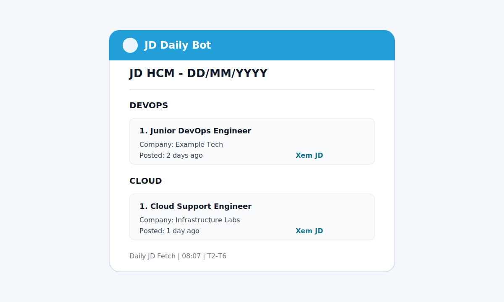
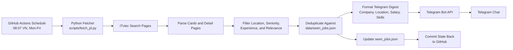

# JD Daily Bot

[](https://github.com/ThanhLam-NetEng/jd-daily-bot/actions/workflows/fetch_jd.yml)


Automated job digest for fresher-friendly IT roles in Ho Chi Minh City. The bot fetches matching JD listings from ITviec, filters out senior or unrelated roles, excludes postings that clearly require more than 2 years of experience, sends a clean Telegram digest every weekday morning, and remembers recently sent jobs to avoid duplicates.

## Demo



> Demo placeholder. Replace this with a real Telegram screenshot after running `Daily JD Fetch` manually from GitHub Actions.

## Why This Project Matters

This is a small but production-minded automation project. It shows practical DevOps habits: scheduled workflows, secret-based configuration, failure visibility, retry handling, state persistence, and clean operational documentation.

## Features

- Scheduled weekday digest at **08:07 Vietnam time**.
- Keyword-based ITviec search for `devops`, `network`, `cloud`, `linux`, and `infrastructure`.
- HCM-focused filtering with senior, irrelevant-role, and high-experience exclusion.
- Digest fields include company, location, salary, skills, posted time, and JD link.
- Telegram delivery with HTML escaping, rate-limit retry, and visible failure logs.
- Duplicate prevention through `data/seen_jobs.json`.
- Manual workflow trigger for testing or ad-hoc runs.

## Filtering Strategy

The bot keeps the digest focused by filtering in multiple passes:

| Filter | Purpose |
| --- | --- |
| Keyword search | Starts from DevOps, Network, Cloud, Linux, and Infrastructure roles. |
| Location filter | Prioritizes HCM listings and removes clearly non-HCM results. |
| Seniority filter | Removes senior, lead, manager, architect, staff, and similar titles. |
| Experience filter | Removes postings that clearly require more than 2 years, such as `3+ years`, `3-5 years`, `at least 3 years`, or `tu 3 nam`. |
| Relevance filter | Removes unrelated tracks such as mobile, frontend, embedded, AI/ML, blockchain, and game roles. |
| Deduplication | Skips jobs already sent in the last 7 days. |

## Architecture



## Repository Structure

```text
.
|-- .github/workflows/fetch_jd.yml   # Scheduled GitHub Actions workflow
|-- data/seen_jobs.json              # Lightweight state for duplicate prevention
|-- scripts/fetch_jd.py              # Fetch, filter, format, and send logic
|-- requirements.txt                 # Python dependencies
|-- .gitignore                       # Local/cache file exclusions
`-- README.md                        # Project documentation
```

## Configuration

Add these repository secrets before running the workflow:

| Secret | Required | Description |
| --- | --- | --- |
| `TELEGRAM_TOKEN` | Yes | Telegram bot token from BotFather. |
| `TELEGRAM_CHAT_ID` | Yes | Telegram chat, group, or channel ID that receives the digest. |

GitHub path:

```text
Settings -> Secrets and variables -> Actions -> New repository secret
```

## Schedule

GitHub Actions cron runs in UTC. Vietnam is UTC+7, so the workflow uses:

```yaml
7 1 * * 1-5
```

That maps to **08:07 Vietnam time, Monday to Friday**. The minute is intentionally not `00` to reduce the risk of top-of-hour GitHub Actions congestion.

## Local Setup

Clone the repository and install dependencies:

```bash
git clone https://github.com/ThanhLam-NetEng/jd-daily-bot.git
cd jd-daily-bot
python -m venv .venv
source .venv/bin/activate
pip install -r requirements.txt
```

Windows PowerShell:

```powershell
git clone https://github.com/ThanhLam-NetEng/jd-daily-bot.git
cd jd-daily-bot
python -m venv .venv
.\.venv\Scripts\Activate.ps1
pip install -r requirements.txt
```

## Run Locally

Linux/macOS:

```bash
export TELEGRAM_TOKEN="your-token"
export TELEGRAM_CHAT_ID="your-chat-id"
python scripts/fetch_jd.py
```

Windows PowerShell:

```powershell
$env:TELEGRAM_TOKEN="your-token"
$env:TELEGRAM_CHAT_ID="your-chat-id"
python scripts/fetch_jd.py
```

## Manual Run

Use GitHub Actions when you want to test the live workflow:

```text
Actions -> Daily JD Fetch -> Run workflow
```

## Reliability Notes

- Telegram responses are checked. Failed sends make the workflow fail instead of silently passing.
- Telegram HTML content is escaped before sending to avoid malformed message errors.
- Rate-limit responses are retried.
- ITviec detail pages are checked when available so experience requirements hidden outside the search card can still be filtered.
- `seen_jobs.json` is updated only after Telegram delivery succeeds.
- The workflow has a 10-minute timeout and concurrency control to avoid overlapping runs.

## Security Notes

- Telegram credentials are read from GitHub Actions secrets.
- Local `.env` files and virtual environments are ignored by Git.
- `data/seen_jobs.json` is intentionally versioned because it is workflow state, not a secret.

## Roadmap

- Add a real Telegram screenshot after the next demo run.
- Add unit tests for filtering and message formatting.
- Add structured logging for fetch, filter, send, and state-update steps.
- Add a dry-run mode for local validation without sending Telegram messages.
