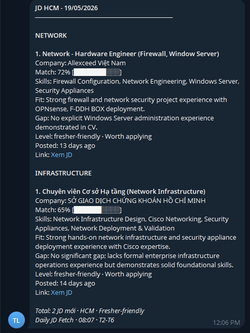
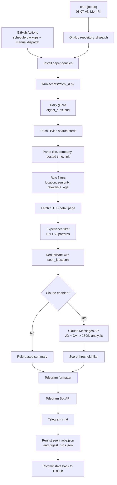

# JD Daily Bot

[](https://github.com/ThanhLam-NetEng/jd-daily-bot/actions/workflows/fetch_jd.yml)


AI-assisted job matching bot for fresher-friendly IT roles in Ho Chi Minh City. The bot fetches ITviec job listings, filters noisy results, reads full JD pages, optionally scores each JD against a private CV with Claude, and sends a concise Telegram digest every weekday morning.

## Demo



## Why This Project Matters

This project is built like a small production automation system, not a one-off script. It combines scheduled CI, web scraping, rule-based filtering, LLM-based JD/CV matching, private secret management, state persistence, and failure-aware Telegram delivery.

## Features

- Runs automatically at **08:07 Vietnam time, Monday to Friday** via cron-job.org, with guarded GitHub Actions backup schedules.
- Searches ITviec for DevOps, Network, Cloud, Linux, and Infrastructure roles.
- Filters by location, seniority, relevance, posting age, duplicate history, and experience requirements.
- Fetches full JD pages to catch requirements that are not visible in search cards.
- Uses Claude Haiku 4.5 to score JD/CV fit when `ANTHROPIC_API_KEY` and `CV_TEXT` are configured.
- Sends Telegram digest with match score, required skills, fit, gap, experience level, verdict, posted time, and JD link.
- Falls back to a rule-based digest if Claude is not configured or the API call fails.
- Supports `DRY_RUN=1` for safe local validation without Telegram delivery or state updates.
- Includes pytest coverage and a dedicated CI workflow for compile/test checks.
- Updates `data/seen_jobs.json` only after Telegram delivery succeeds.

## Output

With Claude enabled, each item is formatted like this:

```text
1. Network - Hardware Engineer (Firewall, Window Server)
Company: Allexceed Viet Nam
Match: 72% [███████░░░]
Skills: Firewall Configuration, Network Engineering, Windows Server
Fit: Strong firewall and network security project experience.
Gap: No explicit Windows Server administration experience.
Level: fresher-friendly · Worth applying
Posted: 13 days ago
Link: Xem JD
```

Without Claude, the bot still sends a deterministic rule-based summary:

```text
Company: ...
Location: Ho Chi Minh
Salary: ...
Matched: NETWORK, Firewall
Posted: ...
Link: Xem JD
```

## Architecture



## Filtering Strategy

| Layer | Purpose |
| --- | --- |
| Keyword search | Starts from `devops`, `network`, `cloud`, `linux`, and `infrastructure`. |
| Location filter | Keeps HCM-focused listings and removes clearly non-HCM results. |
| Seniority filter | Removes senior, lead, manager, architect, staff, and similar titles. |
| Experience filter | Removes postings that clearly require more than 2 years, including English and Vietnamese patterns. |
| Relevance filter | Removes unrelated tracks such as mobile, frontend, embedded, AI/ML, blockchain, and game roles. |
| Claude threshold | When enabled, sends only jobs with `match_score >= 60`. |
| Deduplication | Skips jobs already sent in the last 7 days. |

## Repository Structure

```text
.
|-- .github/workflows/fetch_jd.yml   # Dispatch, manual, and backup scheduled workflow
|-- .github/workflows/test.yml       # CI workflow for compile and pytest checks
|-- data/seen_jobs.json              # Lightweight state for duplicate prevention
|-- data/digest_runs.json            # Daily send guard across all triggers
|-- docs/demo.PNG                    # Telegram demo screenshot
|-- docs/demo-placeholder.svg        # Earlier placeholder asset
|-- scripts/fetch_jd.py              # Fetch, filter, analyze, format, and send logic
|-- requirements.txt                 # Python dependencies
|-- .gitignore                       # Local/cache file exclusions
`-- README.md                        # Project documentation
```

## Configuration

Add these repository secrets before running the workflow:

| Secret | Required | Description |
| --- | --- | --- |
| `TELEGRAM_TOKEN` | Yes | Telegram bot token from BotFather. |
| `TELEGRAM_CHAT_ID` | Yes | Telegram chat, group, or channel ID that receives the digest. |
| `ANTHROPIC_API_KEY` | No | Enables Claude-powered JD/CV matching. |
| `CV_TEXT` | No | Plain-text CV used for Claude matching. Keep this private in GitHub Secrets. |
| `CLAUDE_MODEL` | No | Optional model override. Defaults to `claude-haiku-4-5-20251001`. |

GitHub path:

```text
Settings -> Secrets and variables -> Actions -> New repository secret
```

## Schedule

The primary production trigger is cron-job.org. It calls GitHub's `repository_dispatch` API at **08:07 Vietnam time, Monday to Friday**:

```http
POST https://api.github.com/repos/ThanhLam-NetEng/jd-daily-bot/dispatches
Authorization: Bearer YOUR_GITHUB_TOKEN
Accept: application/vnd.github+json
Content-Type: application/json

{"event_type":"daily-jd-fetch"}
```

Use a fine-grained GitHub token scoped to this repository with **Contents: Read and write** permission. If cron-job.org uses UTC, the cron expression is:

```cron
7 1 * * 1-5
```

That maps to **08:07 Vietnam time** because Vietnam is UTC+7.

GitHub Actions also keeps fallback schedules in UTC:

```yaml
7 1 * * 1-5
27 1 * * 1-5
47 1 * * 1-5
7 2 * * 1-5
```

Those map to **08:07, 08:27, 08:47, and 09:07 Vietnam time**. The bot records successful daily sends in `data/digest_runs.json`, so backup runs exit without sending another Telegram digest once the day has already been handled. The cron-job.org dispatch path was verified in production on **22/05/2026 08:07 VN**.

## Local Setup

```bash
git clone https://github.com/ThanhLam-NetEng/jd-daily-bot.git
cd jd-daily-bot
python -m venv .venv
source .venv/bin/activate
pip install -r requirements.txt
```

Windows PowerShell:

```powershell
git clone https://github.com/ThanhLam-NetEng/jd-daily-bot.git
cd jd-daily-bot
python -m venv .venv
.\.venv\Scripts\Activate.ps1
pip install -r requirements.txt
```

## Run Locally

Rule-based mode:

```bash
export TELEGRAM_TOKEN="your-token"
export TELEGRAM_CHAT_ID="your-chat-id"
python scripts/fetch_jd.py
```

Dry-run mode:

```bash
export DRY_RUN=1
export TELEGRAM_TOKEN="placeholder"
export TELEGRAM_CHAT_ID="placeholder"
python scripts/fetch_jd.py
```

Claude matching mode:

```bash
export TELEGRAM_TOKEN="your-token"
export TELEGRAM_CHAT_ID="your-chat-id"
export ANTHROPIC_API_KEY="your-anthropic-key"
export CV_TEXT="your plain-text CV"
python scripts/fetch_jd.py
```

Windows PowerShell:

```powershell
$env:TELEGRAM_TOKEN="your-token"
$env:TELEGRAM_CHAT_ID="your-chat-id"
$env:ANTHROPIC_API_KEY="your-anthropic-key"
$env:CV_TEXT="your plain-text CV"
python scripts/fetch_jd.py
```

## Manual Run

Use GitHub Actions when you want to test the live workflow:

```text
Actions -> Daily JD Fetch -> Run workflow
```

## Tests

Run the local test suite:

```bash
pytest -q
```

The `Tests` GitHub Actions workflow runs on pushes, pull requests, and manual dispatches. It compiles `scripts/fetch_jd.py` and runs the pytest suite.

## Reliability

- Telegram responses are checked. Failed sends make the workflow fail instead of silently passing.
- Telegram HTML content is escaped before sending to avoid malformed message errors.
- Telegram rate-limit responses are retried.
- Claude output is requested as raw JSON and parsed before formatting.
- Claude matching is capped per run to control API cost and latency.
- If Claude is not configured or returns an error, the bot falls back to the rule-based digest.
- Dry-run mode skips Telegram delivery and `seen_jobs.json` updates.
- `seen_jobs.json` is updated only after Telegram delivery succeeds.
- `digest_runs.json` prevents duplicate daily Telegram digests across cron-job.org, manual runs, and GitHub backup schedules.
- The workflow has a 20-minute timeout and concurrency control to avoid overlapping runs.

## Security And Cost

- Telegram credentials, Claude API key, and CV text are read from GitHub Actions secrets.
- CV content is not committed to the repository.
- Local `.env` files and virtual environments are ignored by Git.
- `data/seen_jobs.json` is intentionally versioned because it is workflow state, not a secret.
- Claude analysis is limited by `MAX_ANALYZE` in code to avoid accidental high API usage.

## Roadmap

- Move tunables such as match threshold, max analysis count, and keywords to environment variables.
- Store historical match scores for trend review.
- Add structured logs for fetch, filter, Claude analysis, send, and state-update steps.
